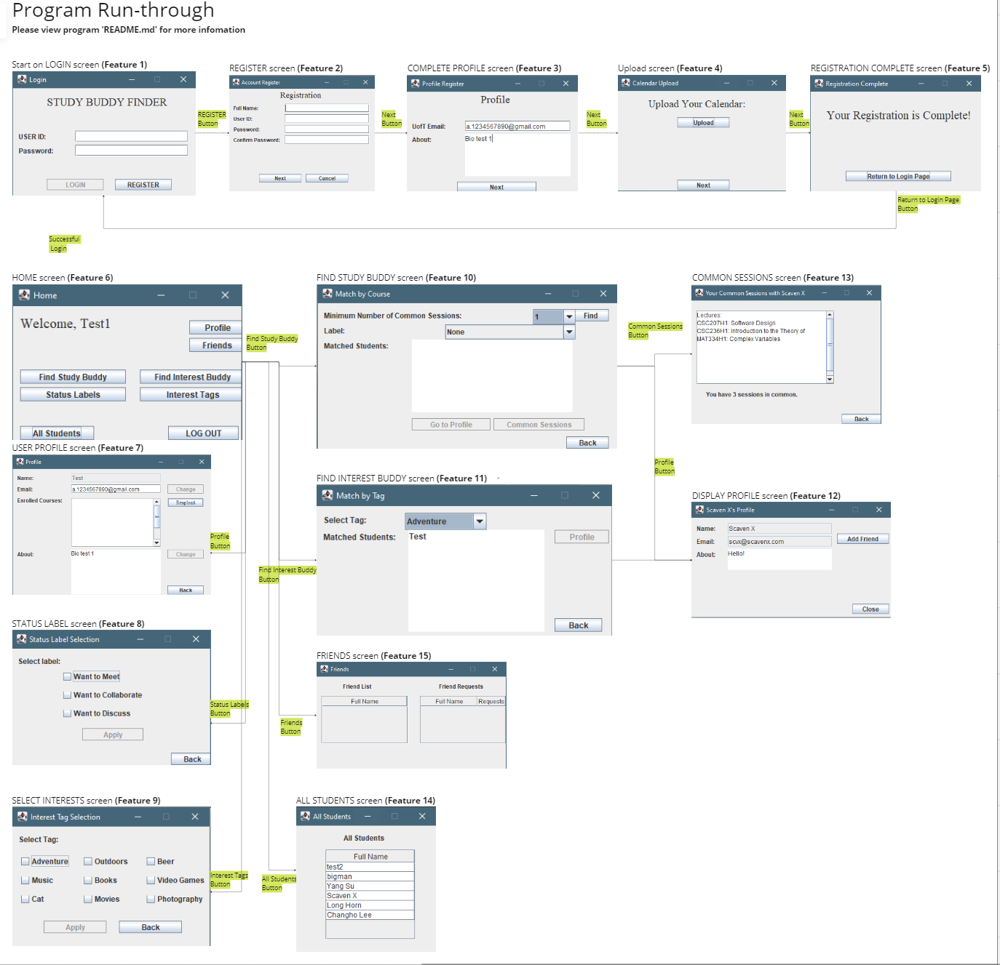
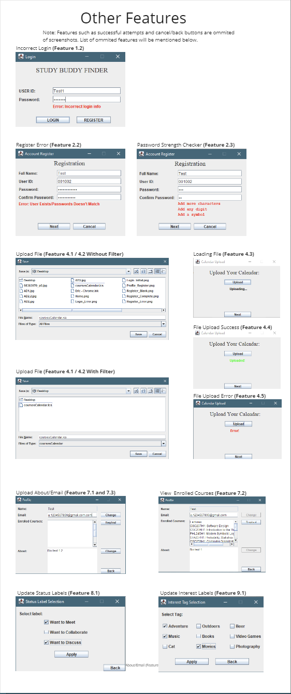
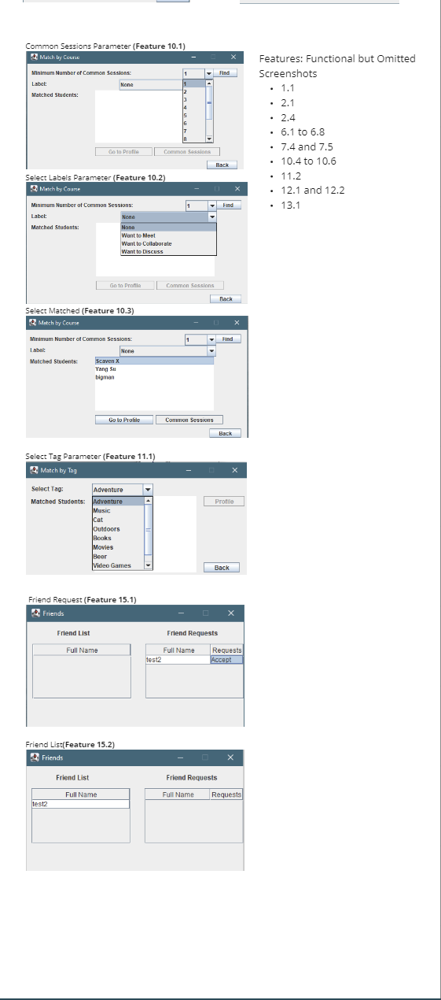
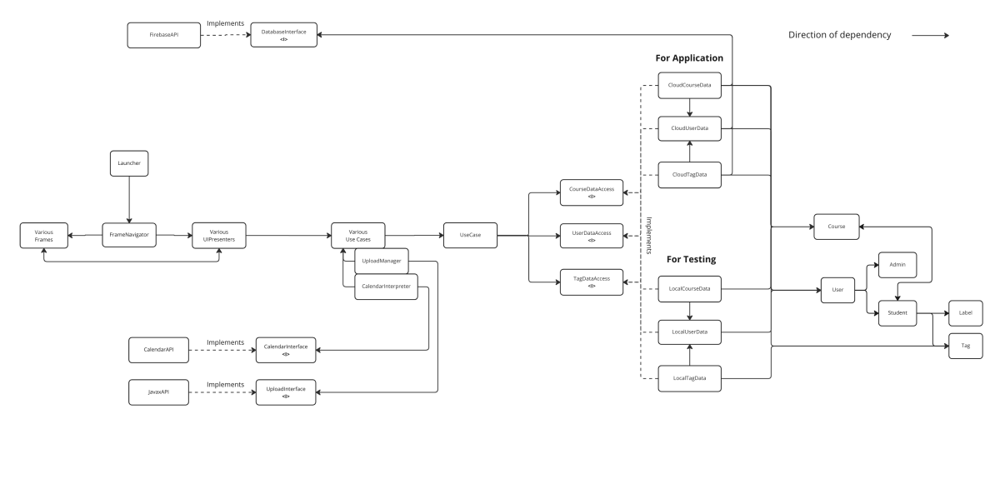
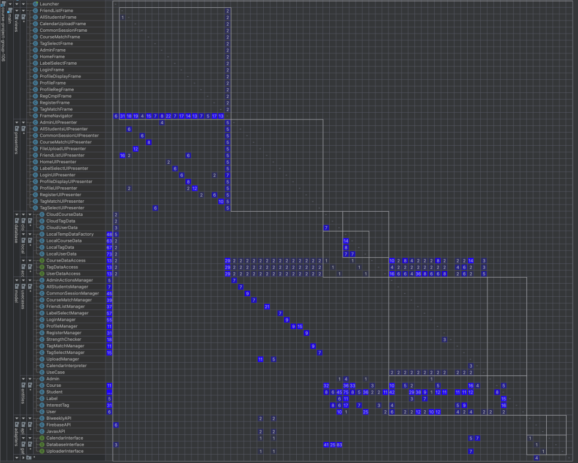
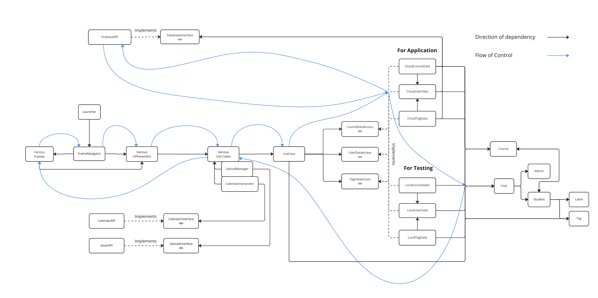

# CSC207 Group-106 "AcademiBuddy"

"ACADEMI BUDDY" is a program that allows similar interest users to connect with each other, based
on each individual's course schedule.

The user navigates through the program's UI, by the end, the program returns other students for the user to connect
with. The user will be presented with other profiles to access. The exact features and frames will be discussed later 
on.

## Program Operation Steps/Features

Program launches on _LOGIN_ screen 

(Note: following **Features** does not match numbering on GitHub).
- **Feature 1** (_LOGIN_ screen):
  - **Feature 1.1** (_LOGIN_ screen, user has an account): User login through the frame and is directed to the _HOME_ 
screen (**Feature 6**).
  - **Feature 1.2** (_LOGIN_ screen, user enters incorrect info): User will be prompted on screen of error. User may try 
again.

- **Feature 2** (_REGISTER_ screen):
  - **Feature 2.1** (_REGISTER_ screen, user doesn't have an account): User click on the "Register" button and fills in 
  the required information.
    After registering, the user is directed to the _COMPLETE PROFILE_ screen (**Feature 3**).
  - **Feature 2.2** (_REGISTER_ screen, user has an account/passwords does not match): On screen, prompts user that
    error has occurred. User may try again.
  - **Feature 2.3** (_REGISTER_ screen, user has an inadequate password): On screen, prompts user reason/s why 
  password is not strong enough
  - **Feature 2.4** (_REGISTER_ screen, user clicks on "Cancel" button): User is directed back to the _LOGIN_ screen 
  (**Feature 1**).

- **Feature 3** (_COMPLETE PROFILE_ screen): User fills in additional information, full name, email, and bio. User is 
then directed to UPLOAD SCREEN (**Feature 4.1**).

- **Feature 4** (_UPLOAD SCREEN_):
  - **Feature 4.1** (_UPLOAD SCREEN_, user first time calendar upload): User uploads a courseCalendar ics file from 
  their computer and data is created and updated to database, Firebase. Note, this step may take a while. 
  User is then directed to _REGISTRATION COMPLETE_ screen (**Feature 5**) by pressing "Next".
  - **Feature 4.2** (_UPLOAD_ screen, user uploads calendar from _USER PROFILE_ screen): Same as (**Feature 4.1**) 
  except user is directed back to their _USER PROFILE_ screen (**Feature 7**).
  - **Feature 4.3** (_UPLOAD_ screen, file loading after being selected): Display "Loading" on screen.
  - **Feature 4.4** (_UPLOAD_ screen, file successfully saved and uploaded to database): Display "Uploaded" on screen.
  - **Feature 4.5** (_UPLOAD_ screen, file unsuccessfully uploaded): Display "Error" on screen.

- **Feature 5** (_REGISTRATION COMPLETE_ screen): After registration, screen is displayed for user to navigate to the
_LOGIN_ screen (**Feature 1**).

- **Feature 6** (_HOME_ screen, user successful login/directed from _REGISTRATION COMPLETE_ screen): User can direct 
them-self, 
using buttons, to navigate to:
  - (**Feature 6.1** _HOME_ screen) "Profile" button navigates to _USER PROFILE_ screen (**Feature 7**).
  - (**Feature 6.2** _HOME_ screen) "Status Labels" button navigates to _STATUS LABELS_ screen (**Feature 8**).
  - (**Feature 6.3** _HOME_ screen) "Interest Tags" button navigates to _SELECT INTERESTS_ screen (**Feature 9**).
  - (**Feature 6.4** _HOME_ screen) "Find Study Buddy" button navigates to _FIND STUDY BUDDY_ screen (**Feature 10**).
  - (**Feature 6.5** _HOME_ screen) "Find Interest Buddy" button navigates to _FIND INTEREST BUDDY_ screen 
  (**Feature 11**).
  - (**Feature 6.6** _HOME_ screen) "All Students" button navigates to _ALL STUDENTS_ screen (**Feature 14**). 
  - (**Feature 6.7** _HOME_ screen) "Friends" button navigates to _FRIENDS_ screen (**Feature 15**).
  - (**Feature 6.8** _HOME_ screen) "LOG OUT" button navigates to "Login" screen (**Feature 1**). 

- **Feature 7** (_USER PROFILE_ screen, user accesses their own profile): User can conduct profile operations 
such as:
  - (**Feature 7.1** _USER PROFILE_ screen) change their email.
  - (**Feature 7.2** _USER PROFILE_ screen) look at their enrolled courses.
  - (**Feature 7.3** _USER PROFILE_ screen) write/update their about.
  - (**Feature 7.4** _USER PROFILE_ screen) upload a new calendar using "Re-upload Button"(**Feature 4.2**).
  - (**Feature 7.5** _USER PROFILE_ screen) click on "back" button and go back to _HOME_ screen (**Feature 6**).

- **Feature 8** (_STATUS LABELS_ screen): User choose and "Apply" the labels they're a part of. "Wants to Meet", etc. 
Then user is directed back to _HOME_ screen (**Feature 6**).
  - (**Feature 8.1** _STATUS LABELS_ screen): User check the boxes for selected labels and hit "Apply" to submit them.
  Once submitted, unless new changes occur, "Apply" button will not be activated.

- **Feature 9** (_SELECT INTERESTS_ screen): User chooses their interests. "Sports", "Music", etc. Then user is 
directed back to _HOME_ screen (**Feature 6**).
  - (**Feature 9.1** _SELECT INTERESTS_ screen): User check the boxes for selected tags and hit "Apply" to submit them.
    Once submitted, unless new changes occur, "Apply" button will not be activated.

- **Feature 10** (_FIND STUDY BUDDY_ screen): User can select "Number of Courses" and "Select Labels" as parameters. 
After clicking on the "Find" button, program will display other users and allow further operations.
  - (**Feature 10.1** _FIND STUDY BUDDY_ screen): Change number of common sessions parameter from 1 to 6.
  - (**Feature 10.2** _FIND STUDY BUDDY_ screen): Open "Select Label" tab to allow searching given similar label 
  parameters.
  - (**Feature 10.3** _FIND STUDY BUDDY_ screen): After user is satisfied with the search parameters, pressing "Find"
  button allows student names to be displayed in "Matched Students" area. This displays up to 5 users and can allow 
  further operations in (**Feature 10.4**).
  - (**Feature 10.4** _FIND STUDY BUDDY_ screen): After selecting and highlighting a user's name from "Match Students"
  area, "Profile" button will be activated, allowing the user to click and access selected profile
    (**Feature 12**).
  - (**Feature 10.5** _FIND STUDY BUDDY_ screen): "Common Sessions" button allows the user to find the common sessions
  between themselves and the selected user (**Feature 13**).
  - (**Feature 10.6** _FIND STUDY BUDDY_ screen): "Back" button allows the user to go back to _HOME_ screen 
  (**Feature 6**).

- **Feature 11** (_FIND INTEREST BUDDY_ screen): Allows user to select given parameters and find matched students.
  - **Feature 11.1** (_FIND INTEREST BUDDY_ screen): "Select Tag" parameter allows users to select he tags they want to
  search for.
  - **Feature 11.2** (_FIND INTEREST BUDDY_ screen): After selecting a tag, user can highlight the matched user and
  click on "Profile" button to access their profile (**Feature 12**).

- **Feature 12** (_DISPLAY PROFILE_ screen): This screen is not modifiable, it is only for view purposes for other
users after selecting the profile.
  - **Feature 12.1** (_DISPLAY PROFILE_ screen): "Add Friend" button sends a friend request to the displayed profile's
  user. This request will be seen by the other user in their friend request list in Friends (**Feature 15.1**).
  - **Feature 12.2** (_DISPLAY PROFILE_ screen): "Close" button will close the screen and return to their previous
  screen.

- **Feature 13** (_COMMON SESSIONS_ screen): Allows the user to see the common sessions between them and the selected
user.
  - **Feature 13.1** (_COMMON SESSIONS_ screen): "Back" button return the user back to _FIND STUDY BUDDY_ screen 
  (**Feature 10**)

- **Feature 14** (_ALL STUDENTS_ screen): Displays all students in the program. This screen is not modifiable directly.

- **Feature 15** (_FRIENDS_ screen): This screen allows the user to manage their friends list.
  - **Feature 15.1** (_FRIENDS_ screen): For any friend request the user receives, it will be displayed under the
  "Friend Request" area where the user can approve the requests.
  - **Feature 15.2** (_FRIENDS_ screen): For any approved friend requests, the friend will be displayed in the
  "Friend List" where the name of the user becomes a button and could be used to access their display
  profile (**Feature 12**). 

## Program Workflow

- This is how each class is organized and their relationships with each other

## Clean Architecture
- Dependency Matrix. Inner layer classes has no dependency on outer layer classes, or through an interface when an dependency is necessary. Note that the left most column represents the test package, not Launcher.

-Flow of control. The frames play the role of both controllers and views here. All interactions between frames and models, input or output, are routed through the presenters (in other words, presenter is the io port of use case classes).

- Softawre architecture is structured in a way that code encapsulates the user logic but keeps it separate from the delivery mechanism.

## SOLID Principle

**Single Responsibility Principle**

We left some unused variables in Course and Student classes and adapted our databases to them for future feature expansion.
Each use cases have its own presenter, frame, and manager, and if we need to use some feature or method across multiple use cases, we make a separate use case.

**Open-Closed Principle**

The project can be extended in many ways. For example, we used multiple interfaces throughout the project. If we decide to use another cloud service instead of Google’s firebase, say AWS, we can write an AmazonAPI and replace the FirebaseAPI, without having to change anything else. We can do the same for the local database in the same fashion.

**Liskov Substitution Principle**

Since we have different types of accounts, we made a user class. And made student and admin its child class, we made sure to call user instead of specific user type through our program whenever possible. And whenever we need to cast the user to a specific user type, we made sure to use a try-catch clause.

**Interface Segregation Principle**

We made sure all classes that implement an interface override all of the interface methods.

**Dependency Inversion Principle**

As the use cases have to depend on the database, we made an interface for the database classes to implement and made the use case classes depend on the interface instead. There are many examples of this beyond the database, for example, our Calendarinterpreter depends on an external library, so we made a ClaendarInterface and made a BiweeklyAPI to implement it and let CalendarInterpreter depend on the interface.

## Design Patterns

**Iterator Design Pattern: write,read counter**

We made write counter and read counter to record on firebase To increase efficeincy and runtime. In each counter there is integer count, whenever read or count occurs, they call the method call addCount method. Whenever we need to get count, we just call getCount.

**Dependency Injection Design Pattern: course class**

We created student objects outside and pass each student into course.

**Builder Design Pattern: LocalTempDataBuilder**

We used builder design pattern to create our local testing data. These data needs to be built in order and has fair amount of complexity since we need to add courses and students, and their friend request in right way.

**Façade Design Pattern: FrameNavigator**

Each frame has a presenter and associated usecase. At first, to navigate a frame, we just initialized the frame presenter and created a frame. Then we found we could implement a Facade design pattern. FrameNavigator is created to initialize all UIPresenters, and implemented "façade methods" to initialize frames.

Before:

`HomeUIPresenter homeUIPresenter = new HomeUIPresenter(database)`

`HomeFrame homeFrame = new HomeFrame(HomeUIPresenter)`

After:

`frameNavigator.toHome()`
