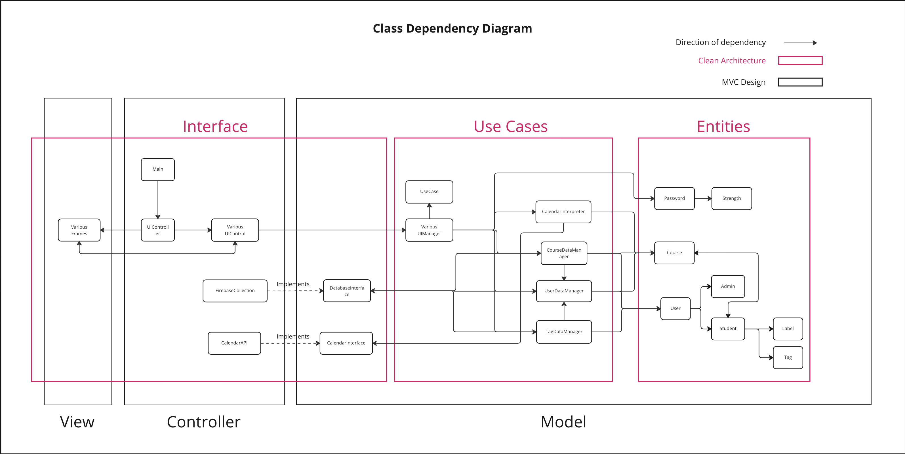

# CSC207 Group-106 "STUDY BUDDY FINDER"

"STUDY BUDDY FINDER" is a program that allows similar interest users to connect with each other, based
on each individual's course schedule.

The user navigates through the program's UI, by the end, the program returns other students for the user to connect
with. The user will be presented with other profiles to access. The exact features and frames will be discussed later 
on.

## Program Operation Steps

Program launches on _LOGIN_ screen 

(Note: following **Features** does not match numbering on GitHub).
- **Feature 1** (_LOGIN_ screen):
  - **Feature 1.1** (_LOGIN_ screen, user has an account): User login through the frame and is directed to the _HOME_ 
screen (**Feature 6**).
  - **Feature 1.2** (_LOGIN_ screen, user enters incorrect info): User will be prompted on screen of error. User may try 
again.

- **Feature 2** (_REGISTER_ screen):
  - **Feature 2.1** (_REGISTER_ screen, user doesn't have an account): User click on the "Register" button and fills in 
  the required information.
    After registering, the user is directed to the _COMPLETE PROFILE_ screen (**Feature 3**).
  - **Feature 2.2** (_REGISTER_ screen, user has an account/passwords does not match): On screen, prompts user that
    error has occurred. User may try again.
  - **Feature 2.3** (_REGISTER_ screen, user clicks on "Cancel" button): User is directed back to the _LOGIN_ screen 
  (**Feature 1**).

- **Feature 3** (_COMPLETE PROFILE_ screen): User fills in additional information, full name, email, and bio. User is 
then directed to UPLOAD SCREEN (**Feature 4.1**).

- **Feature 4** (_UPLOAD SCREEN_):
  - **Feature 4.1** (_UPLOAD SCREEN_, user first time calendar upload): User uploads a courseCalendar ics file from 
  their computer and data is created and updated to database, Firebase. Note, this step may take a while. 
  User is then directed to _REGISTRATION COMPLETE_ screen (**Feature 5**).
  - **Feature 4.2** (_UPLOAD_ screen, user uploads calendar from _USER PROFILE_ screen): Same as (**Feature 4.1**) 
  except user is directed back to their _USER PROFILE_ screen (**Feature 7**).

- **Feature 5** (_REGISTRATION COMPLETE_ screen): After registration, screen is displayed for user to navigate to the
_LOGIN_ screen (**Feature 1**).

- **Feature 6** (_HOME_ screen, user successful login/directed from _REGISTRATION COMPLETE_ screen): User can direct 
them-self, 
using buttons, to navigate to:
  - _USER PROFILE_(**Feature 7**).
  - Select _STATUS LABELS_(**Feature 8**).
  - Select _INTERESTS_(**Feature 9**).
  - _FIND STUDY BUDDY_(**Feature 10**).
  - _FIND INTEREST BUDDY_(**Feature 11**).
  - "Logout" button (**Feature 1**).

- **Feature 7** (_USER PROFILE_ screen, user accesses their own profile): User can conduct profile operations 
such as:
  - change their email.
  - look at their enrolled courses.
  - write/update their about.
  - upload a new calendar using "Upload Button"(**Feature 4.2**).
  - click on "back" button and go back to _HOME_ screen (**Feature 6**).

- **Feature 8** (_STATUS LABELS_ screen): User choose labels they're a part of. "Wants to Meet", etc. Then user 
is directed back to _HOME_ screen (**Feature 6**).

- **Feature 9** (_SELECT INTERESTS_ screen): User chooses their interests. "Sports", "Music", etc. Then user is 
directed back to _HOME_ screen (**Feature 6**).

- **Feature 10** (_FIND STUDY BUDDY_ screen): User can select "Number of Courses" and "Status Labels" to sort from. After 
clicking on the "Find Study Buddy" button, program allows user to click on other users matched (**Feature 12**). 
The user can also click on the "back" button to go back to _HOME_ screen (**Feature 6**).

## Program Workflow

- This is how each class is organized and their relationships with each other

## User Navigation (Features/Frames)

