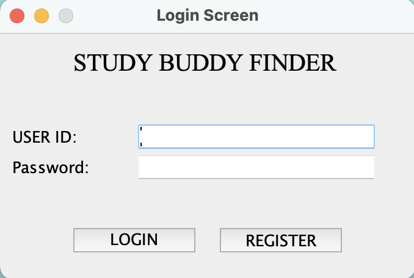
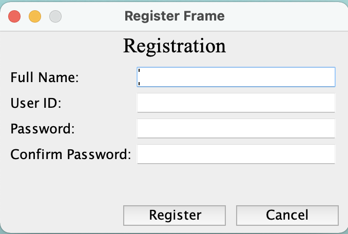

# CSC207 Group-106 "STUDY BUDDY FINDER"

"STUDY BUDDY FINDER" is a program that allows similar interest users to connect with each other, based
on each individual's course schedule.

The user navigates through the program's UI, by the end, the program returns other students for the user to connect 
with. The exact steps and frames will be discussed later on.
## Program Operation Steps
- Program launches on login screen
- - Case 1 (LOGIN, user has an account): User login through the frame and is directed to the home screen
- - Case 2.1 (REGISTER, user doesn't have an account): User click on the register button and fills in the required 
information. 
After registering, the user is directed to the login screen (Case 1)
- - Case 2.2 (REGISTER, user has an account, but attempts to register): On register screen, screen prompts user that 
ID has 
already been used. 
- After login, user is directed to the home screen. This frame allows the user to upload a calendar (.ics) file, which 
then stores the file within the program. Home screen will mention if calendar is uploaded correctly.
- "Find Study Buddy" only if the calendar is successfully uploaded. Which directs the user to the Match screen.
- By clicking on match, the program accesses the established databases. This uploads the calendar, examines the database, and returns matched students.
## Program Workflow

- This is how each class is organized and their relationships with each other

## User Navigation (Features/Frames)
- Login Screen:
- Established users log in, after clicking on LOGIN, user is directed to home screen
- Non-established users goes to register frame
- Incorrect logins will be prompted

- Register Screen:
- User fills in their information, clicks on Register, then gets directed back to "login screen"
- Cancel button will also direct user back to "login screen"
- Incorrect registration (password doesn't match/User ID already used) will be prompted

- Home Screen:
- 

## Gradle Project
You have been provided with two starter files for demonstration: HelloWorld and HelloWorldTest.

You will find HelloWorld in `src/main/java/tutorial` directory. Right-click on the HelloWorld file and click on `Run HelloWorld.main()`.
This should run the program and print on your console.

You will find HelloWorldTest in `src/test/java/tutorial` directory. Right-click on the HelloWorldTest file and click on `Run HelloWorldTest`.
All tests should pass. Your team can remove this sample of how testing works once you start adding your project code to the repo.

Moving forward, we expect you to maintain this project structure. You *should* use Gradle as the build environment, but it is fine if your team prefers to use something else -- just remove the gradle files and push your preferred project setup. Assuming you stick with Gradle, your source code should go into `src/main/java` (you can keep creating more subdirectories as per your project requirement). Every source class can auto-generate a test file for you. For example, open HelloWorld.java file and click on the `HelloWorld` variable as shown in the image below. You should see an option `Generate` and on clicking this you should see an option `Test`. Clicking on this will generate a JUnit test file for `HelloWorld` class. This was used to generate the `HelloWorldTest`.

